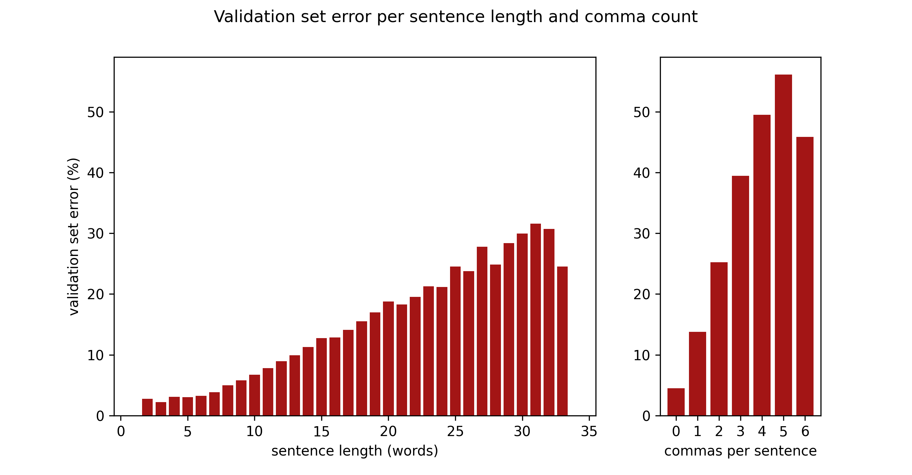
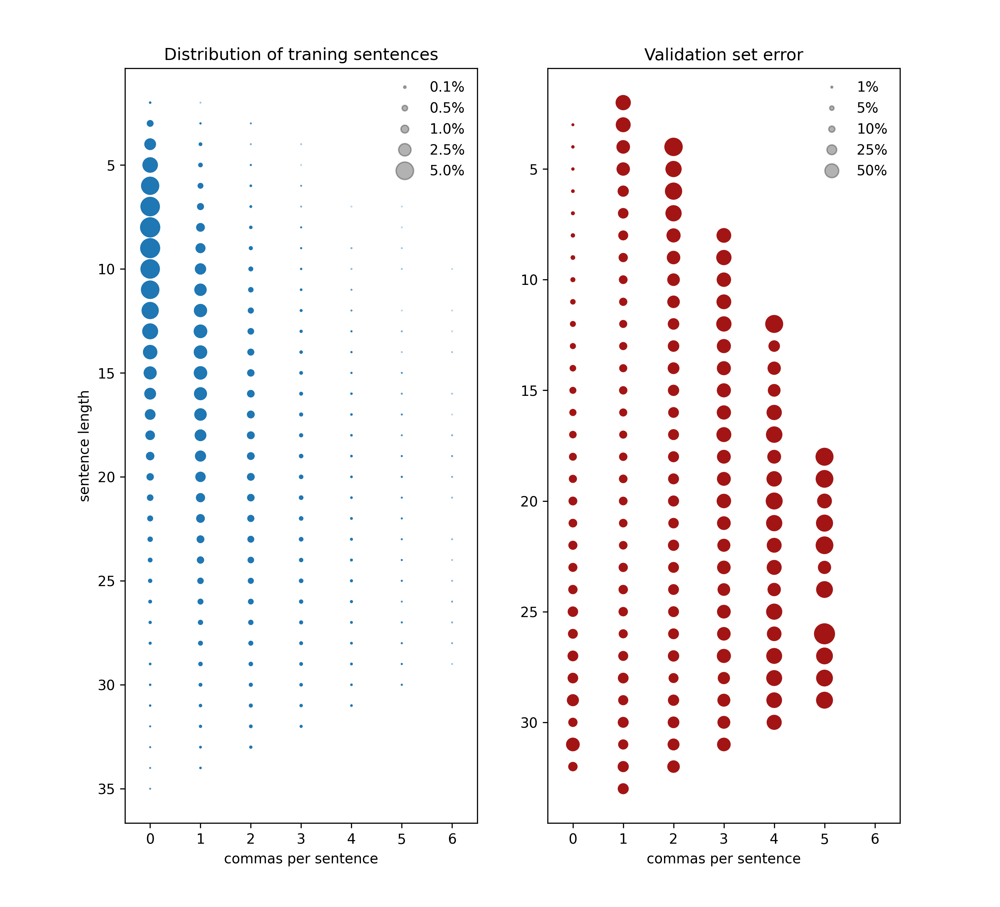

# komma - Learning german punctuation rules

The goal of this project was to teach a neural network how to insert commas into german sentences.  It seemed to be an attainable task and a good start to learn about and experiment with neural nets and natural language processing (NLP). Furthermore, I wanted to prepare my own training data and not use a prepared set for an already established task. Since most german text (with commas set accurately) can be used as training data, by removing the commas and learning to re-insert them, compiling the data should not be too difficult. For implementation, the PyTorch library was used.

This repository contains, a Colab ipython notebook with the model definition and training code as well as the scripts used to prepare the data. The colab notebook loads the prepared training data so it can actually be used for training and experimentation. Pre-trained weights are also provided so you can check the performance of the final model on your favorite german comma question. (Executing the notebook on Colab requires a google account.)


### Training Data

The starting point was a collection of sentences compiled and provided by the [Leipzig Corpora Collection](https://wortschatz.uni-leipzig.de/en/download). I chose the 'web-wrt' corpus with 10 million sentences.  To simplify tokenization all sentences containing other characters than letters, comma, dot, exclamation, and question mark were discarded. Then a dictionary was compiled including all words appearing more than 50 times in the sentences, other words are treated as 'unknown'.

The non-word tokens used are `<pad>` for padding, `<comma>` for commas, `<unk>` for unknown words, and `<eos>` for all end of sentence punctuation.
During the project I experimented with different subsets of the data, starting with short sentences without unknown words, working up to longer sentences with unknown words.

By checking 100 sentences of the training data myself, I estimate that about 95% of the sentences have correct comma positioning. Two of the sample sentences were incomplete and most likely not preprocessed correctly.

The data is split in a training and a validation part. The validation part is used for checking loss and accuracy over unseen data during training and used in the process of hyper-parameter tuning. 

### The task

I decided to model the task of predicting the comma positions as a sequence labeling task, so for every token in the input sequence a label, or output class, is predicted. The input sequence is the tokenized sentence with all `<comma>` tokens _removed_. The label for an input token tells, if after the token a comma shoud be inserted, no comma should be inserted or if the sequence ends. For the sentence 'Ohne zu zögern, klingelte sie an der Tür' this gives the following: 

```
in:     Ohne  zu    zögern  klingelte  sie   an    der   Tür
label:  word  word  comma   word       word  word  word  eos
```

(The class 'no comma after this token' is called 'word' in the example.)

### The model

Each token is embedded as a 300-dimensional word vector. The embeddings are initialized with pre-trained [fastText](https://fasttext.cc/docs/en/crawl-vectors.html) word vectors, but are learnable parameters of the model and updated during training. For the `<unk>` token the average of all other word vectors is chosen as initial embedding.

After embedding, the sequence is fed into a multi-layer Recurrent Neural Network. After a bit of experimentation, it was quickly clear that a bidirectional RNN gave much better results. Since using an LSTM instead of a GRU did not give noticeable improvements, I chose the simpler GRU. The output of the last RNN layer – each part of the sequence separately – is put through a linear layer and a softmax function to predict the output class. Finally, the loss is calculated with the cross-entropy loss function. 
Since the output class 'word' is much more prevalent than 'comma', the loss terms for different output classes were weighted differently. The weights are inversely proportional to the frequency of a class label in all output labels.


### The results

The final model was trained on 4.5 million sentences (maximum length: 35 words, up to 2 unknown words) on Google Colab using a GPU. Accuracy was not evaluated per token but per sentence (a sentence is correct when each word is classified correct). The model and training parameters were:

Number of RNN layers (bi-directional): 3  
RNN layers hidden dimension: 1200  
Optimizer: Adam, default values for beta1 & beta2  
Learning rate: 5e-4  
Batch Size: 180  


After training for 3 epochs (about 9hs of training time) maximum accuracy was achieved. From epoch 4 on the model started to overfit: the loss on the validation set went up again and the accuracy on the validation set went down while still increasing on the training data. The final overall accuracies are:
```
Accuracies (all / sentences with comma / sentences without comma):
training set:    90.84% / 83.56% / 96.03%
validation set:  89.46% / 81.49% / 95.48%
```

Here are the error rates separated by sequence length and comma count in the sentences. Without any surprises, the model makes more errors for longer sequences and sequences with more commas.




Looking at the error by sentence length and sentence comma count in the next plot (right side) shows, that the model performs not generally better on short sentences as on long ones. Sentences with one comma for example have a higher error for short compared to intermediate length.  But the short, one comma sentences are as well not very common in our training data (left side). So these sentences might not be ‘more difficult’ in some way, but just underrepresented in the training set. This suggests balancing the training set better (see coming section).




For completeness, here the commonly used metrics for sequence labeling and our three output classes: eos, comma, and word. 

|  | eos  | comma | word |
| --------------------- | ---- | ----- | ---- |
| precision             | 1.0  | 0.90  | 0.99 |
| recall                | 1.0  | 0.89  | 0.99 |
| f1                    | 1.0  | 0.89  | 0.99 |

Precision: “What part of the commas set by the model, was at an accurate position?”, Recall: “What part of the necessary commas was set by the model?”, f1: harmonic mean of precision and recall

### Some things tried and discarded:

- shrink the word embeddings to a smaller dimension with an additional linear layer before the RNN
- weight decay
- a Conditional Random Field output layer
- pre-training the model on sentences containing at least one comma


### How to go on:

Preprocessing the data and training takes already a lot of resources on my setup, but there is still the option to increase the amount of training data and traning time a bit more. There are however a lot of other ways to continue:

- Finetune the model by another, more systematic hyper-paramter search. I decided on the values using a smaller training set (with shorter sentences) allowing for faster iteration. Maybe this will give some improvements or reduce the training time.

- Use dropout (in the linear output layer and in between the RNN layers). So far my approach against overfitting was more training data, but I guess it is still worth trying to regularize and train for more epochs.

- Check how much the performance of the model depends on the initialization with pre-trained word vectors by choosing random starting values. 

- Balance the training set better. The training data consists to a large part of shorter sentences with no, or just one comma as seen in the plot above. There seem to be many approaches to deal with unbalanced training sets, oversampling of rare cases from the training data for example. But due to a large amount of further available training data, I could just compile a training set with relatively more sentences of the underrepresented classes.

- The large success of different attention mechanisms in sequence models suggests that it might be helpful for comma prediction too. So one option might be to search for a way to adapt a mechanism as used in [1] to my sequence labeling task. (And I'm sure others have tried this already.) Another option is to model the problem directly as sequence to sequence learning. Input: sequence without comma tokens, output: sequence with comma tokens. With this approach attention mechanisms developed for neural machine translation can be used directly. [1]: Bahdanau, Cho & Bengio “_Neural Machine Translation by Jointly Learning to Align and Translate_“,  arXiv:1409.0473

- Switch from using RNNs to a Transformer architecture, either as a sequence labeling task using just an encoder or as sequence to sequence task using an encoder decoder setup.

- Transfer learning: use a pre-trained german language model and adapt it to the task.

- One general difficulty of predicting comma positions is that some types of commas are optional. A training set with sentences where optional commas are sometimes present and sometimes not will hurt the performance of the model since it can't generalize properly. Furthermore, for a consumer product (such as a grammar checker for example) it would be optimal if the model could indicate which commas are needed in a sentence and which are not mandatory.

  Both problems could be solved by annotated training data that distinguishes these two comma types. Since creating such a dataset however will be a lot of work, other ideas are needed.


### Some of the resources used during the project:

PyTorch & NumPy documentation  
Video Lectures of CS224N: Natural Language Processing with Deep Learning  
Natural Language Processing with PyTorch - McMahan & Rao, O’Reilly  
Andrej Karpathy – A Recipe for Training Neural Networks, Blog post  